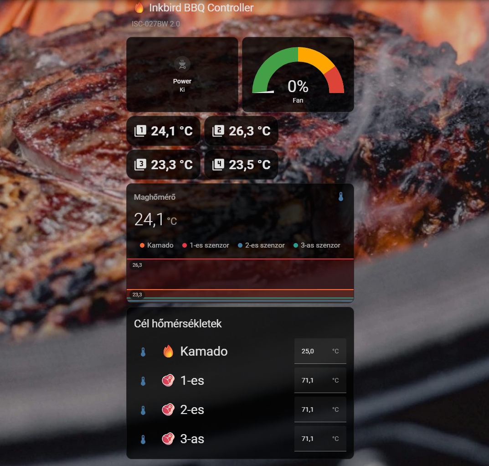

# Inkbird ISC-027BW 2.0 — Home Assistant Integration

Full local control of the Inkbird ISC-027BW 2.0 BBQ fan controller via Home Assistant.

This was previously impossible — neither the Tuya Cloud API nor the standard
Tuya local protocol supports controlling this device. The INKBIRD app uses a
proprietary OEM cloud layer inaccessible to developers.

**We reverse-engineered the protocol and discovered that the device MCU requires
a CRC-16/Modbus checksum appended to DP 107 write payloads.** Without this
checksum, the device silently ignores all write commands.

## Screenshot



## Features

- **Power ON/OFF** control
- **Target temperature** setting for grill + 3 meat probes
- **Live sensor data**: 4 temperatures + fan speed percentage
- **Open lid detection**: automatically detects when the lid is opened (fan drops to 0%)
- **Auto-restart after lid close**: when temperature starts rising again, sends ON command to restart the fan
- **Real-time updates**: device pushes changes automatically (~3-5s interval)
- **Home Assistant MQTT auto-discovery**: entities appear automatically

## Quick Start

### 1. Get Device Credentials

You need three values: `device_id`, `local_key`, and the device's local `IP address`.

#### 1.1 Pair the device with Smart Life app

1. Install the **Smart Life** app ([Android](https://play.google.com/store/apps/details?id=com.tuya.smartlife) / [iOS](https://apps.apple.com/app/smart-life-smart-living/id1115101477))
2. Create an account or log in
3. Add the Inkbird ISC-027BW 2.0 — tap **+** → **Auto Scan** or search for the device
4. Follow the pairing instructions (hold the °C/°F button for 5s until WiFi icon blinks)
5. Verify the device appears in Smart Life and you can see temperature readings

#### 1.2 Create a Tuya IoT Platform project

1. Go to [Tuya IoT Platform](https://iot.tuya.com/) and create a free account
2. Click **Cloud** → **Development** → **Create Cloud Project**
3. Fill in:
   - Project Name: anything (e.g., "Home Assistant")
   - Industry: Smart Home
   - Development Method: Smart Home
   - Data Center: **Central Europe** (or whichever matches your region)
4. After creating the project, go to the **API** tab
5. Subscribe to these APIs (click **Apply** for each):
   - **IoT Core** (required)
   - **Authorization Token Management** (required)

#### 1.3 Link your Smart Life account

1. In your Cloud project, go to the **Devices** tab
2. Click **Link Tuya App Account** → **Add App Account**
3. A QR code appears — scan it **with the Smart Life app**:
   - Open Smart Life → tap **Me** (bottom right) → tap the **QR code scanner icon** (top right)
4. Confirm linking in the app
5. Your Inkbird device should now appear in the **Devices** list

#### 1.4 Get device_id and local_key

1. In the **Devices** tab, you should now see your Inkbird ISC-027BW 2.0
2. Click on it — the **Device ID** is shown on this page
3. To get the **Local Key**, go to **Cloud** → **API Explorer** (left sidebar)
4. Select **Device Management** → **Get Device Information**
5. Enter your `device_id` and click **Submit**
6. In the response, find the `local_key` field — copy this value
7. The device's **local IP address** can be found in your router's admin page (connected devices list) or by running `python -m tinytuya scan`

> **Important:** Every time you re-pair the device or remove/re-add it in Smart Life, the `local_key` changes. You'll need to repeat step 1.4 to get the new key.

### 2. Install the Add-on

1. Copy `addon/` contents to `/addons/inkbird-bridge/` on your HA instance (via Samba share or SSH)
2. Settings → Add-ons → Add-on Store → ⋮ → Check for updates
3. Find **Inkbird ISC-027BW Bridge** under Local add-ons
4. Install → Configure (device ID, IP, local key, MQTT credentials) → Start
5. Enable "Start on boot"

### 3. Done

The device appears under Settings → Devices & Services → MQTT with:
- 6 sensors (Grill/Probe 1-3 temp, Fan speed, Lid state)
- 4 number controls (target temperatures)
- 1 switch (Power ON/OFF)

## Protocol Documentation

See [PROTOCOL.md](PROTOCOL.md) for the full reverse-engineered protocol
specification, including byte maps, CRC algorithm, and code examples.

## File Structure

```
├── README.md           # This file
├── PROTOCOL.md         # Full protocol documentation
└── addon/
    ├── config.yaml     # HA add-on configuration
    ├── build.yaml      # Docker build configuration
    ├── Dockerfile      # Container build file
    └── inkbird_bridge.py  # MQTT bridge (Python)
```

## Requirements

- Home Assistant OS or Supervised
- Mosquitto MQTT broker add-on
- Inkbird ISC-027BW 2.0 on the same local network
- Tuya IoT Platform account (free) for device credentials

## License

MIT — use freely, share widely. If this helped you, consider sharing on the
[Home Assistant Community](https://community.home-assistant.io/).
